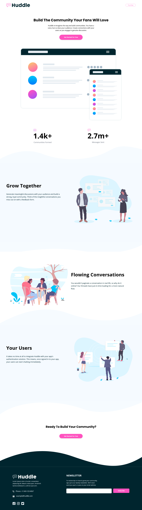

# Frontend Mentor - Huddle landing page with curved sections solution

This is a solution to the [Huddle landing page with curved sections challenge on Frontend Mentor](https://www.frontendmentor.io/challenges/huddle-landing-page-with-curved-sections-5ca5ecd01e82137ec91a50f2).

## Table of contents

- [Overview](#overview)
  - [The challenge](#the-challenge)
  - [Screenshot](#screenshot)
  - [Links](#links)
- [My process](#my-process)
  - [Built with](#built-with)
  - [What I learned](#what-i-learned)
  - [Continued development](#continued-development)
  - [Useful resources](#useful-resources)
- [Author](#author)
- [Acknowledgments](#acknowledgments)

## Overview

### The challenge

Users should be able to:

- View the optimal layout for the site depending on their device's screen size
- See hover states for all interactive elements on the page

### Screenshot



### Links

- Solution URL: [FrontendMentor.io](https://www.frontendmentor.io/solutions/huddle-landing-page-with-curved-sections-solution-using-tailwindcss-l9bcIo9zo)
- Live Site URL: [Vercel](https://prj-16-huddle-landing-page-with-curved-sections.vercel.app/)

## My process

### Built with

- Semantic HTML5 markup
- CSS custom properties
- Flexbox
- CSS Grid
- Mobile-first workflow
- [tailwindcss](https://tailwindcss.com/) - CSS library

### What I learned

Use of FontAwesome icons:

```html
<div class="flex flex-nowrap space-x-4 py-12 lg:pl-24">
  <div class="hover:text-sky-400 hover:cursor-pointer">
    <i class="fab fa-facebook-square fa-2x"></i>
  </div>
  <div class="hover:text-sky-400 hover:cursor-pointer">
    <i class="fab fa-instagram fa-2x"></i>
  </div>
  <div class="hover:text-sky-400 hover:cursor-pointer">
    <i class="fab fa-twitter-square fa-2x"></i>
  </div>
</div>
```

Customizing TailwindCSS theme:

```js
module.exports = {
  content: ["./index.html", "./src/**/*.{vue,js,ts,jsx,tsx}"],
  theme: {
    extend: {
      fontFamily: {
        openSans: ["Open Sans", "sans-serif"],
        poppins: ["Poppins", "sans-serif"],
      },
      colors: {
        pink: "hsl(322, 100%, 66%)",
        lightPink: "hsl(321, 100%, 78%)",
        lightRed: "hsl(0, 100%, 63%)",
        veryDarkCyan: "hsl(192, 100%, 9%)",
        veryPaleBlue: "hsl(207, 100%, 98%)",
      },
      backgroundImage: {
        bgfootertopdesktop: "url('images/bg-footer-top-desktop.svg')",
        bgfootertopmobile: "url('images/bg-footer-top-mobile.svg')",
        bgsectionbottomdesktop1:
          "url('images/bg-section-bottom-desktop-1.svg')",
        bgsectionbottomdesktop2:
          "url('images/bg-section-bottom-desktop-2.svg')",
        bgsectionbottommobile1: "url('images/bg-section-bottom-mobile-1.svg')",
        bgsectionbottommobile2: "url('images/bg-section-bottom-mobile-2.svg')",
        bgsectiontopdesktop1: "url('images/bg-section-top-desktop-1.svg')",
        bgsectiontopdesktop2: "url('images/bg-section-top-desktop-2.svg')",
        bgsectiontopmobile1: "url('images/bg-section-top-mobile-1.svg')",
        bgsectiontopmobile2: "url('images/bg-section-top-mobile-2.svg')",
      },
      backgroundPosition: {
        mytop: "top -2rem",
      },
    },
  },
  plugins: [],
};
```

### Continued development

Future projects will be developed using Vue.JS when interactivity must be included.

### Useful resources

- [TailwindCSS Directives](https://tailwindcss.com/docs/functions-and-directives) - Use of @apply directive
- [Form states](https://tailwindcss.com/docs/hover-focus-and-other-states#form-states) - Style form elements in different states using modifiers like required, invalid, and disabled.
- [Customizing Colors in TailwindCSS](https://tailwindcss.com/docs/customizing-colors) - Adding personalized color names to be used in tailwindcss.
- [Customizing Fonts in TailwindCSS](https://tailwindcss.com/docs/font-family#using-custom-values) - Adding Google fonts to be used in tailwindcss.

## Author

- Website - [Gustavo Sanchez](https://www.gusanche.dev)
- Frontend Mentor - [@gusanchedev](https://www.frontendmentor.io/profile/gusanchedev)
- Github - [@gusanchedev](https://www.github.com/gusanchedev)
- Twitter - [@gusanchedev](https://www.twitter.com/gusanchedev)
- Linkedin - [gusanchedev](https://www.linkedin.com/in/gusanchedev/)

## Acknowledgments

Thanks to Mariapaz for being my friend and support 💙
